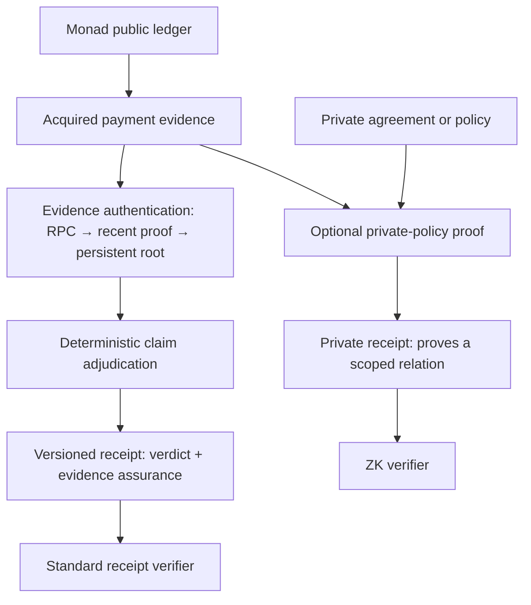
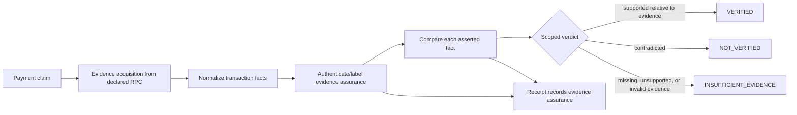

# Veridra — Technical README

This document records the design at repository inception. Proposed behavior is labeled as intent; it is not evidence of an implementation.

## Product boundary

The intended input is a Monad transaction hash plus explicit payment assertions such as asset, amount, sender, and recipient. The intended output is a set of per-assertion outcomes (`PASS`, `FAIL`, `ABSTAIN`) and an overall verdict:

| Verdict | Intended meaning |
|---|---|
| `VERIFIED` | Every applicable assertion in the declared scope matches the acquired and normalized evidence. This is scoped to the evidence assurance reported alongside it. |
| `NOT_VERIFIED` | Usable evidence contradicts at least one applicable assertion. |
| `INSUFFICIENT_EVIDENCE` | Required evidence could not be acquired, reconstructed, interpreted, or authenticated under the selected path. |

`verdict` and `evidence_assurance` are orthogonal. For example, `VERIFIED / RPC_ATTESTED` means the claim matches evidence returned by the declared RPC source; it does not mean the provider cryptographically signed the response or that consensus inclusion was independently proven. The planned assurance progression is `RPC_ATTESTED`, `RECENT_BLOCKHASH_PROOF`, then `PERSISTENT_ROOT_PROOF`. Exact enum names and encoding remain implementation decisions. An example in the product brief also uses `PARTIALLY_VERIFIED`; whether that is an overall verdict or whether partiality remains visible only in per-assertion outcomes is unresolved. The product does not claim to establish wallet ownership, legal settlement of an obligation, or offchain delivery.

Every persistent receipt must carry an explicit `schema_version`. A reader selects the parser/verifier for that version and rejects unknown versions or assurance variants explicitly; it must not silently map an unknown variant to a weaker or stronger known value. A change that old consumers cannot safely interpret requires a new schema version, and supported old versions retain their readers/verifiers for the declared compatibility period. This is a design requirement, not a finalized ABI.

Conceptually, a receipt contains distinct sections rather than one overloaded “verified” flag:

```text
schema_version
claim + scope
verdict + per_assertion_results
evidence_assurance
evidence_provenance { chain_id, provider/source, observed_at, block_number, block_hash }
evidence_reference { transaction, receipt, relevant_logs }
deterministic_checks
```

The exact encoding, canonicalization, and retention policy are open. For Level 1, `provider/source` names the configured source; it must not imply a cryptographic provider signature.

## Destination and levels

**Destination:** a payment-verification service for merchants, marketplaces, and automated agents. A client supplies a bounded payment claim; Veridra returns evidence, per-assertion outcomes, and a receipt that can be independently checked. The service must make its evidence source and trust assumptions visible. It must not turn a ledger fact into a claim about identity, contract performance, or legal discharge.

Each level below is a coherent product state. None is a disposable prototype, and the later levels must extend earlier ones without bypassing their evidence or authorization rules. Level 1 has a Solidity adjudicator and immutable receipt registry, a TypeScript RPC acquisition/publication/verification library, and a minimal CLI, exercised live end-to-end against Monad testnet (see README "Live on Monad testnet"). It is not complete: there is no user-facing caller beyond the CLI, and no selected production finality/token policy.

The intended product has a normal public-evidence path and may have a separate selective-disclosure path. This diagram is conceptual; the privacy path exists only if Level 7 passes its entry conditions. Claim semantics remain stable as the authentication path improves.



The private path must preserve the link between evidence authenticated under its declared assurance level and the proved statement. A proof over prover-selected payment facts alone is insufficient. The standard receipt remains available whether or not the optional path is built.

### Level 1 — RPC-attested single-payment evidence

Accept one Monad transaction hash and explicit assertions about one supported direct native MON transfer or direct ERC-20 transfer. Obtain the transaction, receipt, relevant logs, block number/hash, and chain ID from a declared RPC/provider; record when the evidence was observed and which facts were deterministically checked. Compare every asserted field and return a bounded, versioned receipt. `RPC_ATTESTED` means provider-attributed acquisition under this design; it is not a provider signature and does not claim trustless or consensus-authenticated history.

**Implemented contract surface:** `src/PaymentAdjudicator.sol` compares the transaction hash, chain ID, execution status, and any asserted sender, recipient, asset, and amount. It preserves `PASS` / `FAIL` / `ABSTAIN`; a failed check produces `NOT_VERIFIED`, and missing or insufficiently final evidence produces `INSUFFICIENT_EVIDENCE`. `src/VeridraReceiptRegistry.sol` accepts submissions from one immutable publisher, evaluates them against `block.chainid`, and stores a version-1 receipt with `RPC_ATTESTED`, source ID, observation time, evidence digests, checks, and verdict. Repeated identical submissions return the same receipt ID.

**Trust boundary:** the contract does not call an RPC or authenticate the publisher/provider. The publisher supplies normalized facts, digests of canonically serialized RPC result objects, provider identity, and its finality-policy observations. The contract deterministically compares and records those inputs; it cannot prove those inputs came from the named RPC. The finality fields are publisher assertions, not an onchain confirmation check. The receipt is an immutable record of that publisher's submission and the contract's comparison.

**Complete when:** the Monad RPC producer, publisher flow, and receipt consumer operate together; cross-consistency among transaction, receipt, and containing block is checked; native MON and allowlisted-token extraction follow the rules above; unsupported or ambiguous evidence fails closed; the RPC result objects can be canonically serialized and matched to their recorded digests; and an independent consumer can read and check the versioned receipt. Reorganization/finality policy, token identity, and RPC trust limits must be specified. This level does not infer invoice references, arbitrary token semantics, identity, or delivery.

### Level 2 — Recent inclusion-proof receipt

Upgrade the same receipt's evidence assurance by verifying transaction and receipt inclusion against a block header whose hash is anchored with EVM `BLOCKHASH`. The header must remain in the 256 most recent completed-block window when checked. The 256-block bound is the protocol constraint; any wall-clock duration is derived from actual network cadence and is not a fixed receipt guarantee. The adjudication semantics and claim evidence shape do not change.

**Evidence acquisition decision:** use Monad's raw-data JSON-RPC methods (`debug_getRawHeader`, `debug_getRawBlock`, `debug_getRawTransaction`, and `debug_getRawReceipts`) to acquire the encoded header, transactions, and receipts needed to construct proofs. These methods are data transport only: RPC responses remain untrusted until a proof is checked against the header hash read from `BLOCKHASH`. A proof producer may use a different source or a local node, provided it emits the same bounded proof format. The canonical trie keys are `RLP(transactionIndex)`; transaction and receipt values retain their EIP-2718 typed-envelope bytes. The RPC source must return mutually consistent data, but that consistency is not itself an assurance claim.

`src/RecentInclusionVerifier.sol` composes that anchor with `src/MerklePatriciaProof.sol`: it requires both the caller's expected hash and `keccak256(rawHeader)` to equal `BLOCKHASH`, reads the anchored header's transaction and receipt roots, verifies both trie paths at the same `RLP(transactionIndex)`, and checks that the raw transaction hashes to the requested transaction hash. The raw-header hash check is load-bearing: adversarial review reproduced acceptance of MPT proofs under roots from an unanchored caller-supplied header before this check was added (see [Level 2 red-team review](docs/RED_TEAM_LEVEL2.md)). The proof parser fails closed and bounds each raw value to 8 KiB, each node to 8,256 bytes, each proof to 20 nodes/40,000 total bytes, and the header to 4 KiB. Oversized inputs revert and are not accepted as evidence. The Solidity verifier proves inclusion only; it does not recover the signer, decode transfer facts, adjudicate the claim, persist a receipt, or upgrade the registry's assurance code. Foundry tests include a three-node hashed-branch vector from the offchain proof builder, rejection of a mutated leaf, and rejection of a valid proof under a header hash different from the anchored block. Monad documents the raw methods in its [JSON-RPC API](https://docs.monad.xyz/reference/json-rpc/api#debug_getRawHeader); Ethereum's trie model defines the transaction and receipt roots and typed values ([Merkle Patricia Trie](https://ethereum.org/developers/docs/data-structures-and-encoding/patricia-merkle-trie/)).

`offchain/src/mptProof.ts` provides two offline utilities. `buildTransactionAndReceiptProofs` accepts complete ordered raw transaction and receipt values and returns canonical indexed MPT roots and target proof nodes. `buildInclusionProofFromRawBlock` decodes a bounded RLP block plus its raw receipts, locates a requested transaction by hash, reconstructs the header, and rejects if the locally built transaction or receipt root differs from that header. Inputs are capped at 4,096 entries, 8 KiB for each selected target transaction/receipt value (matching the onchain verifier), 2 MB combined across all transaction and receipt values, 2 MB for the encoded block, and 4 KiB for the header. Unselected values may individually exceed 8 KiB, but remain covered by the shared 2 MB aggregate bound. `offchain/src/paymentFacts.ts` derives a narrow direct-native or allowlisted direct-token transfer fact from the exact raw transaction and receipt values selected by that proof; it checks transaction signature/hash, chain context, typed receipt envelope, and bounded receipt logs. This is fact extraction, not separate proof verification: generated MPT proofs must still be checked by the Solidity verifier against the recent onchain `BLOCKHASH`, and the current read-only `eth_call` result is still RPC-reported. A token's emitted event is not a general proof of its balance semantics. Monad documents the raw block, header, and receipts response formats in its [JSON-RPC API](https://docs.monad.xyz/reference/json-rpc/api#debug_getRawBlock).

`offchain/src/proofRpc.ts` adds `acquireRecentInclusionProof`, which gets the target's block number/index/hash from `eth_getTransactionByHash`, then fetches `debug_getRawBlock` and `debug_getRawReceipts`. It bounds every JSON-RPC response to 5 MB, checks the configured chain, matches the raw block header hash/number and target index against the transaction lookup, delegates root reconstruction to `mptProof.ts`, and derives `paymentFact` from the selected raw transaction and receipt values. This establishes internal consistency among responses from one RPC source, not their truth; only the onchain `BLOCKHASH` comparison authenticates the header, and the current `eth_call` response remains RPC-reported. Monad RPC compatibility and end-to-end acquisition were confirmed for one direct native transfer; this is not a systematic live method or transaction-shape matrix.

`offchain/src/verifyInclusion.ts` exposes `verifyRecentInclusionOnchain` as a read-only call to the configured `RecentInclusionVerifier`. It takes a bounded snapshot of the proof and token policy before its first asynchronous boundary, re-derives the payment fact from the exact transaction and receipt values in that snapshot, and rejects if the attached fact, transaction hash, or chain context differs. Before the inclusion call it checks the configured chain, reads the target address's runtime bytecode, and compares its Keccak-256 hash with a caller-maintained deployment pin `(chainId, address, runtimeCodeHash)`. The bytecode response is rejected above 64 KiB before hashing. This catches a wrong address/code configuration relative to that pin; it does not authenticate the RPC that supplies the code or `eth_call` result, and the two RPC reads are not atomic. On a `true` result the wrapper returns the locally re-derived fact alongside `RPC_REPORTED_RECENT_INCLUSION_ACCEPTED`. Because the RPC response itself is unauthenticated, this client result remains provider-attributed.

`script/DeployRecentInclusionVerifier.s.sol` is a separate deployment path that checks `block.chainid == 10143` before broadcasting, reads the deployer's private key from `PRIVATE_KEY`, and prints only the deployer address, deployed address, and runtime code hash. On 2026-10-02 it deployed `RecentInclusionVerifier` at [`0x6f0512740A569a4EF2e3f148513866Df97D5E0a8`](https://testnet.monadexplorer.com/address/0x6f0512740A569a4EF2e3f148513866Df97D5E0a8); the receipt succeeded at block `67709091` using 3,634,723 gas. At the receipt's effective gas price the actual fee was `0.374376469003634723 MON`. The observed runtime hash was `0xa4d1836d69eedbf3f90b5ef986e583b35153487d9cf06983fd90a8695fd0d80e`.

`offchain/src/portableReceipt.ts` adds schema-1 JSON export and verification through `createPortableInclusionReceipt` / `verifyPortableInclusionReceipt`. It carries the claim, raw bounded proof bundle, derived payment fact, recomputable verdict/checks, token policy, verifier pin, and caller-declared IDs for the proof source and producer/consumer verification RPCs. The parser rejects unknown fields/versions, noncanonical or oversized JSON, mismatched roots/index/chain/hash, and out-of-bound proof data. Consumer verification re-runs fact extraction, the pinned verifier call, and claim adjudication, then compares them with the artifact's assertions. Source IDs are labels from their respective callers, not cryptographic provider attestations. The result remains `RPC_REPORTED_RECENT_INCLUSION_ACCEPTED`, not authenticated `RECENT_BLOCKHASH` assurance; the consumer must trust or otherwise authenticate its RPC execution. This artifact is re-verifiable only while the block remains inside the EVM `BLOCKHASH` window and is not durable history.

**Complete when:** the proof binds transaction, receipt, index, block header, chain, and selected transfer facts; the target Monad network's behavior is confirmed; malformed or mutated proofs fail closed; and the timing/availability limit is stated in blocks. A proof against a caller-supplied root without an authenticated anchor is insufficient.

**Live induction (2026-10-02):** using the public Monad testnet RPC, `acquireRecentInclusionProof` acquired direct native transfer [`0xd03d2e30b55b398ee8d3c3de803ff832b31571658a425f63942f103e57c52936`](https://testnet.monadexplorer.com/tx/0xd03d2e30b55b398ee8d3c3de803ff832b31571658a425f63942f103e57c52936), included at block `67710927`, for 1 wei. The producer generated a schema-1 portable artifact (5,160 serialized bytes); a consumer reparsed it, rederived the fact, recomputed the `VERIFIED` verdict, checked the deployed runtime pin, and called the verifier. The observed result was `RPC_REPORTED_RECENT_INCLUSION_ACCEPTED`, with two proof nodes in each trie path. The deployment receipt is [`0x231baff322d940f5eefe1589e63e5a4cc18390bb5871a43d6d7b555d6ec9348c`](https://testnet.monadexplorer.com/tx/0x231baff322d940f5eefe1589e63e5a4cc18390bb5871a43d6d7b555d6ec9348c). **Scope:** acquisition, producer verification, and consumer reverification used the same public RPC; this confirms one native-transfer path on Monad testnet, not an independent provider, authenticated RPC execution, ERC-20 live behavior, or a broad transaction matrix. The artifact was generated in memory and is not retained; later reverification is constrained by the 256-block window. Reopen this claim if the same flow fails for another valid recent native payment, if another RPC disagrees, or if a malformed proof is accepted.

**Additional live induction (2026-10-03):** on the same public RPC (`https://testnet-rpc.monad.xyz`), `acquireRecentInclusionProof` acquired EIP-1559 direct native transfer [`0x22b9176c5bc9bbbe2909163275788db04ab5b9fd87492a793a134c8eeb280753`](https://testnet.monadexplorer.com/tx/0x22b9176c5bc9bbbe2909163275788db04ab5b9fd87492a793a134c8eeb280753), included at block `67849839`, for 10 wei. In one process, a schema-1 portable receipt with the matching amount was produced and reverified as `VERIFIED`; a second receipt over the same proof but asserting 11 wei was produced and reverified as `NOT_VERIFIED` with only the `amount` check failing. Both verifier calls returned `RPC_REPORTED_RECENT_INCLUSION_ACCEPTED`, demonstrating that inclusion acceptance and claim adjudication remain distinct on this live path. Each trie proof had three nodes. A separate EIP-1559 self-transfer of 1 wei at block `67849193` also completed portable-receipt production and reverification as `VERIFIED` in one run ([transaction](https://testnet.monadexplorer.com/tx/0x6995f841c9820aaff8d6cd53c82eee311e56e4de5497850d336234fd07b47707)); a later attempt using that same block reverted with `BlockOutsideWindow`, as expected after the 256-block recency window elapsed. **Scope remains limited:** these observations used one public RPC for acquisition and consumer calls, do not authenticate RPC responses, and do not cover live ERC-20 transfers, a second provider, or a broad transaction-shape matrix. Artifacts were generated in memory and are not retained.

### Level 3 — Persistent historical-root receipts

Preserve independent verification beyond the recent `BLOCKHASH` window using an authenticated persistent root mechanism, such as a maintained light client, oracle, or checkpointing system. The mechanism and its trust assumptions are explicit; “persistent” describes the retained authenticated history, not an unspecified trustless property.

**Complete when:** root authority, update/finality rules, censorship and liveness assumptions, historical coverage, and recovery behavior are specified; old receipts remain verifiable under the declared mechanism; and adversarial review tests conflicting roots and authority failures.

### Level 4 — Prior payment expectations

Allow a payer or recipient to register an authorized expectation before settlement. A later verified transfer can be compared with that prior expectation to establish whether the stated sender, recipient, asset, amount, reference, and deadline match. The registration mechanism may use Solidity only if its authority and temporal-order properties are defined and actually enforced.

**Complete when:** registration authority, duplicate handling, privacy of public-chain data, temporal ordering, and expiry are specified; every state has a terminal path; and no value is held unless every reachable terminal state has an explicit disposition. A commitment registry that only stores a hash must not be described as verifying the committed terms.

### Level 5 — Merchant or marketplace integration

Expose the completed receipt flow through a user-facing path and an API or SDK for one named first customer type. A client can request verification and consume the result without reimplementing EVM transaction semantics. The integration handles retries, duplicate requests, stale reads, and chain reorganizations according to a declared finality policy.

**Complete when:** the first user and the workflow being replaced are named; integrations receive the same scoped evidence result as the verifier; repeated requests are safe; and no external action is triggered by a result whose required evidence is unavailable or unauthenticated.

### Level 6 — Bounded complex payments and claim disputes

Add transaction shapes such as multiple transfers, router-mediated payments, or internal calls only one at a time, with an explicit reconstruction rule for each. Compare contradictory claims against the same authenticated evidence and report consistency without deciding who is truthful in a human or legal sense.

**Complete when:** every added shape has an independent evidence rule, unsupported shapes remain distinguishable, resource bounds are explicit, and adversarial review confirms that all earlier level invariants still hold. An unbounded “supports any EVM transaction” claim is outside this level.

### Level 7 — Private receipt (optional, gated)

Add a ZK-backed receipt only for a user who needs to prove a statement about private commercial terms or an undisclosed policy—for example, that an amount is within an authorized range or a recipient belongs to an allowed set—without revealing the full terms. This is an optional capability alongside the ordinary receipt; users who do not need selective disclosure must not pay its proof-generation or verification complexity.

**Entry conditions:** name the first user and the exact disclosure they cannot accept; inventory each input as already public on Monad or genuinely private; state the public statement and private witness precisely; show that the proof binds the relevant policy/commitment to authenticated payment evidence rather than accepting prover-chosen facts; and compare simpler alternatives such as a scoped public receipt or a signed selective-disclosure statement. If the proof does not reduce a named disclosure, do not add it.

**Complete when:** the verifier checks the exact statement and all public inputs, including chain, verifier/circuit version, policy commitment, and freshness or replay domain; an independent implementation can reject altered or mismatched witnesses; the ordinary receipt path remains available unchanged; and adversarial review checks both proof soundness boundaries and the information the public transcript still reveals. No cryptographic security claim is made until the exact construction, dependencies, setup assumptions, and verification evidence are reviewed.

**Privacy boundary:** Monad's public ledger remains public. ZK cannot hide a transfer amount, address, token, or timing that an observer can already read from the ledger. A potential gain is hiding an additional private agreement, reference mapping, authorization policy, or relation between public ledger facts and private terms. The privacy claim is falsified if the supposedly hidden fact can be reconstructed from the public chain and available context, or if the proof does not disclose less than the non-ZK alternative.

ZK is not a required milestone and does not define the product's trust model. Its inclusion must be earned by a measurable selective-disclosure requirement. If no such requirement survives user research and adversarial analysis, Level 7 is omitted.

## Construction rule: destination-driven, never MVP-shaped

This repository follows the `destination-driven-construction` skill. Levels are product states, not technical phases such as “security now, persistence later.” Security, evidence provenance, bounded work, explicit authority, and honest failure states are properties of every level that needs them from its first implementation.

**Reduce depth, not integrity.** Under a deadline, attempt fewer complete levels. Do not propose a disposable MVP, demo-only contract, or thin implementation that postpones a load-bearing property. A level is complete only when its own acceptance conditions and inherited invariants hold; unreached levels remain unbuilt.

Each new level receives an adversarial review for its own behavior and preservation of earlier invariants. At the chosen stopping level, perform an integrated adversarial review across all completed levels before integrated verification. This cadence does not delay local evidence or checks required by other skills, and it does not create a new TDD mandate. See the `destination-driven-construction` skill for the full method.

## Intended evidence path



`offchain/src/rpcEvidence.ts` implements bounded JSON-RPC acquisition and extraction for a single payment fact. `offchain/src/publishReceipt.ts` connects acquisition to the registry, checks chain/schema/publisher, simulates the call, submits it through a caller-supplied wallet client, and handles duplicate publication. `offchain/src/verifyReceipt.ts` is the independent consumer: it reads a published receipt and recomputes its verdict from a separate TypeScript re-implementation of `PaymentAdjudicator.evaluate()`, rejecting an unsupported schema version or evidence-assurance variant rather than guessing at it, and raising `ReceiptIntegrityError` if its own recomputation ever disagrees with the stored result. `offchain/src/cli.ts` exposes both `verify` and `publish` over this library (`npm run build && node dist/cli.js publish <txHash> --registry <address> ...` / `verify <receiptId> --registry <address>`). The viem ABI is exported from the Foundry artifact with `scripts/export_abi.py`. The Solidity contracts implement deterministic adjudication over normalized facts and immutable receipt recording; they do not fetch RPC data or authenticate the provider response. `VeridraReceiptRegistry` is deployed and Sourcify-verified on Monad testnet, and the full `publish` → `verify` flow has been run live against it twice — once asserting correct claim fields (`VERIFIED`) and once with a deliberately wrong recipient against the same real transaction (`NOT_VERIFIED`, `recipient` check `FAIL`) — with the independent verifier agreeing with the registry's stored result in both cases. See README "Live on Monad testnet" for the addresses and transaction hash.

### Level 1 component boundary

Level 1 needs an offchain RPC client plus transaction extraction, deterministic adjudication, and receipt serialization. The current contract adds two narrower properties: it applies the same fixed claim comparisons onchain and preserves the publisher's versioned submission in immutable storage. It does not make the RPC answer more authentic. The single immutable publisher is a product trust authority; key rotation or multi-publisher policy requires a versioned design rather than silently widening this contract.

The TypeScript acquisition sequence is:

1. Read `eth_chainId` and compare it with the configured Monad network.
2. Fetch `eth_getTransactionByHash` and `eth_getTransactionReceipt` for the requested hash.
3. Fetch the receipt's containing block with `eth_getBlockByNumber` and check that transaction, receipt, and block agree on transaction hash, block number, and block hash.
4. Apply the declared finality/reorganization policy before returning a usable result. Null, inconsistent, unsupported, or not-yet-final evidence yields `INSUFFICIENT_EVIDENCE`; a successfully acquired receipt with failed execution contradicts a claim that the payment succeeded and yields `NOT_VERIFIED`.
5. Extract exactly one supported fact: either a successful top-level native MON value transfer with an empty input field, or one standard `Transfer` event from an explicitly configured token address that is also the transaction's direct target. A transaction with no supported fact, multiple supported facts, or a `Transfer` event from an unconfigured token returns `INSUFFICIENT_EVIDENCE`. Native evidence records the transaction's top-level `from`, `to`, and `value`; it does not establish the recipient's net balance change. Token symbols and decimals are not used. The token allowlist is an operator policy; it does not prove that a token contract obeys ERC-20 semantics or that its event reflects recipient balance changes.

The adapter returns exact `bigint` values for chain IDs, amounts, block counts, timestamps, and confirmation depths. Token amounts are in base units; display decimals are outside adjudication. No float enters the decision path. Future ratios must use exact numerator/denominator values with explicit rounding rules.

The source identifier must be safe to publish: never put API keys or bearer credentials in a receipt. `observed_at` is supplied as a canonical unsigned decimal string and is the verifier host's observation time, not a consensus timestamp. The adapter canonicalizes each JSON-RPC result object by sorting object keys and hashes its UTF-8 JSON with Ethereum Keccak-256. These are digests of normalized parsed RPC objects, not raw HTTP byte transcripts. A matching ERC-20-shaped `Transfer` log is not sufficient by itself to establish arbitrary token balance semantics; the initial adapter only accepts configured token addresses and still inherits those contracts' semantics and the RPC's honesty.

The contract receipt is an immutable record of publisher-supplied facts and deterministic comparisons, not a cryptographic proof of the RPC's honesty. The contract stores digests of the transaction, receipt, and logs; the raw payloads remain necessary offchain to inspect or reproduce those digests. A hash or integrity seal cannot upgrade `RPC_ATTESTED` into consensus authentication.

## Trust boundary: historical EVM evidence

An EVM contract cannot query arbitrary historical transaction receipts or read past event logs. Solidity's documentation states that contracts cannot access log data after creation; logs are accessed from outside the chain. Therefore, passing a transaction hash to a contract does not let that contract independently reconstruct the transaction's past transfers. [Solidity documentation](https://docs.soliditylang.org/en/latest/contracts.html#events) · [Ethereum data storage strategies](https://ethereum.org/developers/docs/data-availability/blockchain-data-storage-strategies/)

Any design for historical payment verification must identify how offchain transaction data becomes authenticated. Level 1 intentionally uses a declared RPC/provider as the acquisition authority and labels that provenance `RPC_ATTESTED`; this label is not evidence that the provider signed its response. Later levels may add inclusion proofs or persistent authenticated roots. A contract that merely stores a caller-supplied hash would provide a record of that submission, not proof that the underlying payment claim is true.

Monad's current documentation says full nodes provide historical transactions, receipts, events, and traces, with older data served from archive nodes configured and operated by providers; arbitrary historical state is a separate, limited capability. This supports evidence acquisition through RPC, but not authentication of an RPC answer. Monad also documents transaction types 0, 1, 2, and 4 (EIP-7702), so any proof parser must explicitly scope supported envelopes. [Monad historical data](https://docs.monad.xyz/developer-essentials/historical-data) · [Monad transactions](https://docs.monad.xyz/developer-essentials/transactions)

Standard EVM `blockhash` exposes hashes for only the 256 most recent completed blocks. That 256-block bound is the protocol constraint. Any approximate wall-clock window depends on block cadence observed or documented for the target network and must not be frozen into the receipt protocol. A verifier could anchor a supplied block header to `blockhash`, then verify transaction and receipt inclusion under its roots. Whether this works on the selected Monad network must be checked directly. The reviewed Monad docs do not establish EIP-2935 history-storage support; do not assume it. [Solidity `blockhash`](https://docs.soliditylang.org/en/latest/units-and-global-variables.html#block-and-transaction-properties) · [Monad introduction](https://docs.monad.xyz/) · [EIP-2935](https://eips.ethereum.org/EIPS/eip-2935)

The alternatives, trust model, selected progression, and decision record are in [`docs/ARCHITECTURE_FRACTURE.md`](docs/ARCHITECTURE_FRACTURE.md).

## Security properties to preserve

These are shared requirements. The adjudicator represents the scoped-check behavior and returns insufficient evidence when evidence is absent or its publisher-declared finality fields do not meet the declared threshold. It cannot detect RPC fetch/decode failures because that client is not implemented:

- **Fail closed:** fetch, decode, proof, or verification failures must not produce `VERIFIED`.
- **Scoped claims:** unspecified fields are `ABSTAIN`; they are not treated as successful checks.
- **No overreach:** ledger evidence must not be presented as proof of identity, legal discharge, or physical delivery.
- **Deterministic comparison:** use integer token base units and explicit chain/token identifiers; avoid floating-point values and ambiguous display strings in consequential comparisons. If a future policy needs a fractional ratio, encode it as an exact numerator/denominator pair and define reduction, bounds, and rounding behavior explicitly.
- **Bounded inputs and work:** the current contract accepts only fixed-size structs and a seven-check loop. Dynamic evidence, transaction-shape arrays, and RPC payload-size limits remain part of the offchain client's design.
- **Explicit authority:** document who can submit, attest, revoke, or challenge evidence before any contract holds value or creates a durable verdict.

## Decisions still open

1. **Evidence authentication details:** Level 1's RPC source identity, observation-time semantics, finality/reorg policy, and exact receipt fields; Level 2's proof format and supported transaction/receipt trie rules; Level 3's persistent-root authority and update rules. The level progression is decided, while these implementation details remain open. See [`docs/ARCHITECTURE_FRACTURE.md`](docs/ARCHITECTURE_FRACTURE.md).
2. **Transaction scope:** native MON and ERC-20 are the suggested first cases in the project brief. Internal calls, routers, multiple transfers, and non-standard tokens need explicit support decisions; they must not be implied by a generic “transaction verified” label.
3. **Onchain role:** identify a product property that requires a contract. Commitments and receipt registries are candidates only if they add a named property beyond an offchain signed or sealed result.
4. **User and distribution:** name the first user and test the claim workflow before expanding into invoice settlement or dispute adjudication.
5. **Network and finality:** define the confirmation/finality policy used before reporting a result, and how reorganization or unavailable RPC history affects it.

## Falsifiers and implementation evidence

The fail-closed requirement is falsified if missing, unsupported, malformed, or invalid evidence yields a non-insufficient verdict. The scoping requirement is falsified if an omitted claim field is represented as a passing check. The assurance label is falsified if a receipt claims a stronger authentication mechanism than the verifier actually checked. A `VERIFIED / RPC_ATTESTED` result is falsified when the claim does not match the evidence returned by its declared source; it does not independently attest that source's honesty.

The Solidity contracts compile with solc 0.8.24, optimizer enabled, and `viaIR: true`, matching the repository's Foundry configuration. The TypeScript source type-checks with strict mode and viem 2.57.2, pinned with a committed lockfile. `npm ci --ignore-scripts` succeeded, and `npm audit` reported no known advisories in the resolved tree. `forge test` runs 41 tests against `PaymentAdjudicator`, `VeridraReceiptRegistry`, and `RecentInclusionVerifier`, covering fail-closed evidence handling, ABSTAIN scoping, FAIL dominance (fuzzed across the four optional fields), publisher-only access control, bounded input validation, idempotent resubmission, recent inclusion proofs including an offchain-generated hashed-branch vector, rejection of an unanchored header, and the deploy-script chain guard. `npm test` in `offchain/` runs 53 tests (Node's built-in test runner) against claim parsing, RPC evidence acquisition against a mocked JSON-RPC endpoint, proof construction, raw payment-fact extraction, portable receipt creation/parsing/reverification, runtime-code pin rejection/bounds, and independent receipt verification. One live Level 2 run on 2026-10-02 acquired, verified, and reverified a portable receipt for a direct native transfer; scope and transaction evidence are recorded in the Level 2 live-induction note above. That run used one public Monad RPC for acquisition and both verifier calls. No second-provider or live ERC-20 Level 2 matrix has been run. `VeridraReceiptRegistry` is deployed and Sourcify-verified (`exact_match`) on Monad testnet at `0x2a78a4542CC70929DCd8e7a8dE096588F7607f61`; the `publish` and `verify` CLI commands have been run against it with a real native MON transfer (`0x27d5f9bd45f4022cd87a343c29218e4d6671fbfad626aeafe56fd28f5142fba6`), covering both the `VERIFIED` and `NOT_VERIFIED` paths. That live Level 1 run does not establish behavior across the broader space of real transaction shapes, nor the truth of publisher-supplied evidence beyond what the RPC provider actually returned.

### Initial adversarial review of Level 1 contracts

**Threat model:** arbitrary callers may submit malformed or contradictory values, but cannot call as the configured publisher. The publisher key, RPC provider, compiler, chain consensus, and deployment process are trusted inputs for this level; compromise or dishonesty of the publisher is outside the contract's protection.

- **Code fact:** only the immutable `publisher` can create receipts. Claim/evidence structs have fixed sizes, and adjudication has a fixed seven-element check loop.
- **Code fact:** the contract compares claim and evidence chain IDs to `block.chainid`, requires nonzero provenance identifiers and observation time, rejects future observation times, and rejects missing transaction/receipt/log digests when evidence is marked available.
- **Code fact:** absent evidence or a missing/unsatisfied publisher-declared finality policy produces `INSUFFICIENT_EVIDENCE`; with usable evidence, any failed check yields `NOT_VERIFIED`; unspecified optional assertions remain `ABSTAIN`.
- **Accepted trust boundary:** the publisher can fabricate transaction facts, payload digests, provider identity, and confirmation counts, then obtain `VERIFIED` if those fabricated values match the claim. This follows from the declared RPC-attested trust model; the contract does not authenticate them.
- **Operational risk:** the publisher address cannot rotate. Losing its key stops new receipt publication; a future rotation mechanism needs explicit authority and receipt-version semantics.
- **Verified by test and by one live run:** the state transitions and access-control/validation reverts above are exercised by the Foundry suite; the RPC extraction logic is exercised by the Node test suite against a mocked JSON-RPC endpoint; neither suite exercises gas behavior as a property. The end-to-end flow (`acquirePaymentEvidence` → `publishReceipt` → a real deployed `VeridraReceiptRegistry` → `verifyReceipt`) has additionally been run against Monad testnet with one real transaction, on both the `VERIFIED` and `NOT_VERIFIED` paths — this is evidence from one transaction shape (a direct native MON transfer) and one deployment, not a systematic live-RPC test matrix.

## Source context

PROOF is the conceptual reference: a local Python/Stellar project with claim validation, evidence extraction, per-field adjudication, three verdicts, and sealed bundles. Veridra is a new Solidity and TypeScript implementation for an EVM chain. No source code from PROOF is copied into this repository.
