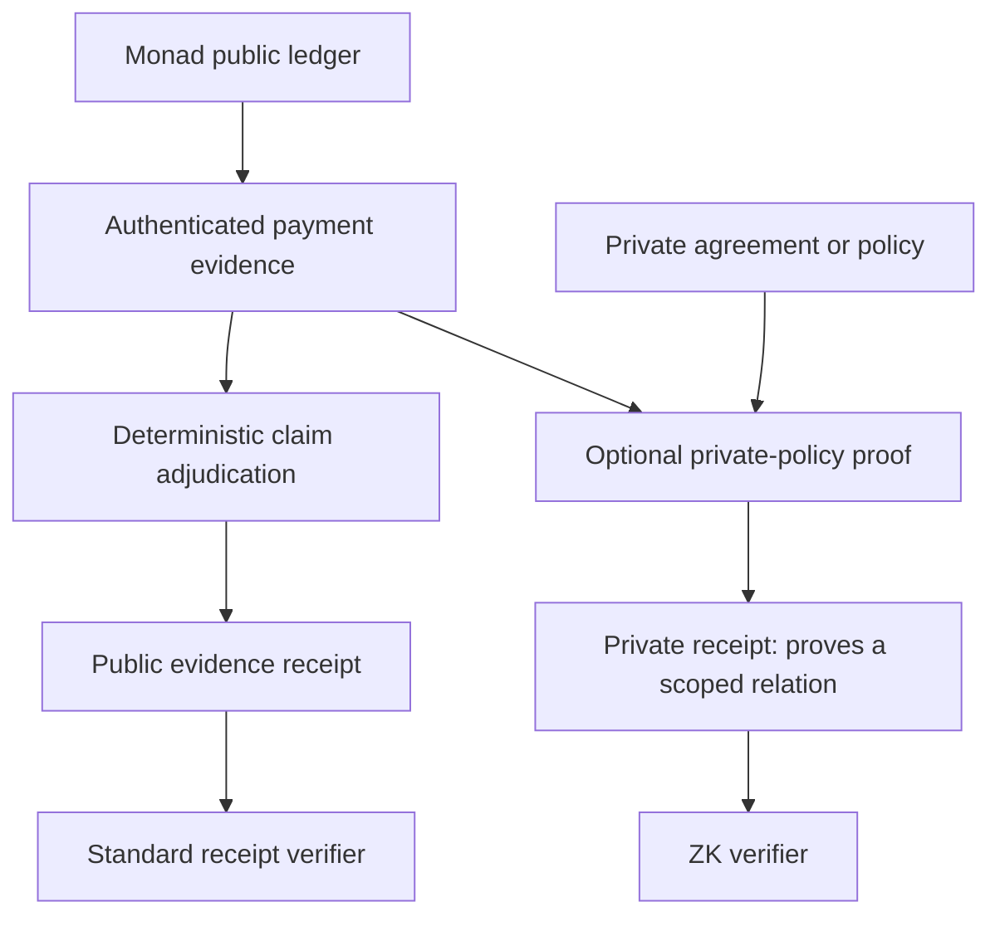
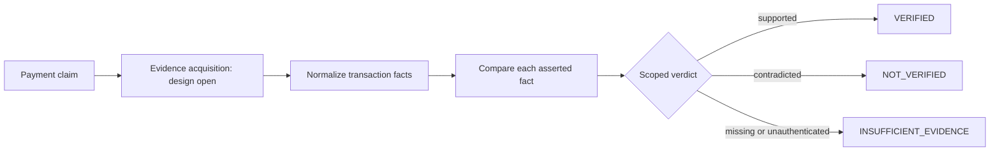

# Veridra — Technical README

This document records the design at repository inception. Proposed behavior is labeled as intent; it is not evidence of an implementation.

## Product boundary

The intended input is a Monad transaction hash plus explicit payment assertions such as asset, amount, sender, and recipient. The intended output is a set of per-assertion outcomes (`PASS`, `FAIL`, `ABSTAIN`) and an overall verdict:

| Verdict | Intended meaning |
|---|---|
| `VERIFIED` | Every applicable assertion in the declared scope is supported by authenticated evidence. |
| `NOT_VERIFIED` | Evidence was available and contradicts at least one applicable assertion. |
| `INSUFFICIENT_EVIDENCE` | The evidence source failed, the relevant facts could not be reconstructed, or the result cannot be authenticated. |

These names and semantics are proposed and must be fixed before implementation. An example in the product brief also uses `PARTIALLY_VERIFIED`; whether that is an overall verdict or whether partiality remains visible only in per-assertion outcomes is unresolved. The product does not claim to establish wallet ownership, legal settlement of an obligation, or offchain delivery.

## Destination and levels

**Destination:** a payment-verification service for merchants, marketplaces, and automated agents. A client supplies a bounded payment claim; Veridra returns evidence, per-assertion outcomes, and a receipt that can be independently checked. The service must make its evidence source and trust assumptions visible. It must not turn a ledger fact into a claim about identity, contract performance, or legal discharge.

Each level below is a coherent product state. None is a disposable prototype, and the later levels must extend earlier ones without bypassing their evidence or authorization rules. All levels are proposed; none is implemented.

The intended product has a normal public-evidence path and may have a separate selective-disclosure path. This diagram is conceptual; the privacy path exists only if Level 6 passes its entry conditions.

The private path must preserve the link between authenticated ledger evidence and the proved statement. A proof over prover-selected payment facts alone is insufficient. The standard receipt remains available whether or not the optional path is built.

### Level 1 — Single-payment fact verification

Accept one Monad transaction hash and explicit assertions about one direct native MON transfer or one direct ERC-20 transfer. Reconstruct the supported facts, compare every asserted field, and return a bounded result. Unsupported transaction types, missing data, unavailable history, or unauthenticated evidence do not yield `VERIFIED`.

**Complete when:** the evidence-authentication model is selected and documented; both supported transfer forms have explicit extraction rules; unsupported forms fail closed; and the claim vocabulary, amount units, token identity, finality policy, and verdict semantics are specified. This level does not infer invoice references, contract-internal transfer semantics, identity, or delivery.

### Level 2 — Portable evidence receipt

Package the claim, authenticated evidence, per-assertion results, scope notes, source and version metadata into a versioned receipt. Provide a verifier that can independently validate the receipt without importing the adjudication path that created it. Define what the receipt's integrity seal proves and what it does not prove.

**Complete when:** canonical encoding is specified; token amounts use exact integer units; chain and token identifiers are unambiguous; evidence provenance is included; and mutation of any sealed field is rejected by the independent verifier. A hash of caller-supplied data alone is not evidence authentication.

### Level 3 — Prior payment expectations

Allow a payer or recipient to register an authorized expectation before settlement. A later verified transfer can be compared with that prior expectation to establish whether the stated sender, recipient, asset, amount, reference, and deadline match. The registration mechanism may use Solidity only if its authority and temporal-order properties are defined and actually enforced.

**Complete when:** registration authority, duplicate handling, privacy of public-chain data, temporal ordering, and expiry are specified; every state has a terminal path; and no value is held unless every reachable terminal state has an explicit disposition. A commitment registry that only stores a hash must not be described as verifying the committed terms.

### Level 4 — Merchant or marketplace integration

Expose the completed receipt flow through a user-facing path and an API or SDK for one named first customer type. A client can request verification and consume the result without reimplementing EVM transaction semantics. The integration handles retries, duplicate requests, stale reads, and chain reorganizations according to a declared finality policy.

**Complete when:** the first user and the workflow being replaced are named; integrations receive the same scoped evidence result as the verifier; repeated requests are safe; and no external action is triggered by a result whose required evidence is unavailable or unauthenticated.

### Level 5 — Bounded complex payments and claim disputes

Add transaction shapes such as multiple transfers, router-mediated payments, or internal calls only one at a time, with an explicit reconstruction rule for each. Compare contradictory claims against the same authenticated evidence and report consistency without deciding who is truthful in a human or legal sense.

**Complete when:** every added shape has an independent evidence rule, unsupported shapes remain distinguishable, resource bounds are explicit, and adversarial review confirms that all earlier level invariants still hold. An unbounded “supports any EVM transaction” claim is outside this level.

### Level 6 — Private receipt (optional, gated)

Add a ZK-backed receipt only for a user who needs to prove a statement about private commercial terms or an undisclosed policy—for example, that an amount is within an authorized range or a recipient belongs to an allowed set—without revealing the full terms. This is an optional capability alongside the ordinary receipt; users who do not need selective disclosure must not pay its proof-generation or verification complexity.

**Entry conditions:** name the first user and the exact disclosure they cannot accept; inventory each input as already public on Monad or genuinely private; state the public statement and private witness precisely; show that the proof binds the relevant policy/commitment to authenticated payment evidence rather than accepting prover-chosen facts; and compare simpler alternatives such as a scoped public receipt or a signed selective-disclosure statement. If the proof does not reduce a named disclosure, do not add it.

**Complete when:** the verifier checks the exact statement and all public inputs, including chain, verifier/circuit version, policy commitment, and freshness or replay domain; an independent implementation can reject altered or mismatched witnesses; the ordinary receipt path remains available unchanged; and adversarial review checks both proof soundness boundaries and the information the public transcript still reveals. No cryptographic security claim is made until the exact construction, dependencies, setup assumptions, and verification evidence are reviewed.

**Privacy boundary:** Monad's public ledger remains public. ZK cannot hide a transfer amount, address, token, or timing that an observer can already read from the ledger. A potential gain is hiding an additional private agreement, reference mapping, authorization policy, or relation between public ledger facts and private terms. The privacy claim is falsified if the supposedly hidden fact can be reconstructed from the public chain and available context, or if the proof does not disclose less than the non-ZK alternative.

ZK is not a required milestone and does not define the product's trust model. Its inclusion must be earned by a measurable selective-disclosure requirement. If no such requirement survives user research and adversarial analysis, Level 6 is omitted.

## Construction rule: destination-driven, never MVP-shaped

This repository follows the `destination-driven-construction` skill. Levels are product states, not technical phases such as “security now, persistence later.” Security, evidence provenance, bounded work, explicit authority, and honest failure states are properties of every level that needs them from its first implementation.

**Reduce depth, not integrity.** Under a deadline, attempt fewer complete levels. Do not propose a disposable MVP, demo-only contract, or thin implementation that postpones a load-bearing property. A level is complete only when its own acceptance conditions and inherited invariants hold; unreached levels remain unbuilt.

Each new level receives an adversarial review for its own behavior and preservation of earlier invariants. At the chosen stopping level, perform an integrated adversarial review across all completed levels before integrated verification. This cadence does not delay local evidence or checks required by other skills, and it does not create a new TDD mandate. See the `destination-driven-construction` skill for the full method.

## Intended evidence path

This is a conceptual flow, not an implemented architecture. The intended onchain component will be written in Solidity. It is not yet decided whether a contract will verify a proof, accept an attestation, record a receipt, or be unnecessary for the first verification flow.

## Trust boundary: historical EVM evidence

An EVM contract cannot query arbitrary historical transaction receipts or read past event logs. Solidity's documentation states that contracts cannot access log data after creation; logs are accessed from outside the chain. Therefore, passing a transaction hash to a contract does not let that contract independently reconstruct the transaction's past transfers. [Solidity documentation](https://docs.soliditylang.org/en/latest/contracts.html#events) · [Ethereum data storage strategies](https://ethereum.org/developers/docs/data-availability/blockchain-data-storage-strategies/)

Any design for historical payment verification must identify how offchain transaction data becomes authenticated. Candidate approaches include a proof checked by the contract, a signed attestation from a defined verifier set, or an integrated payment flow that checks facts during the payment call. These approaches have different trust assumptions; no choice is made here. A contract that merely stores a caller-supplied hash would provide a record of that submission, not proof that the underlying payment claim is true.

## Security properties to preserve

These are design requirements, not implemented guarantees:

- **Fail closed:** fetch, decode, proof, or verification failures must not produce `VERIFIED`.
- **Scoped claims:** unspecified fields are `ABSTAIN`; they are not treated as successful checks.
- **No overreach:** ledger evidence must not be presented as proof of identity, legal discharge, or physical delivery.
- **Deterministic comparison:** use integer token units and explicit chain/token identifiers; avoid floating-point values and ambiguous display strings in consequential comparisons.
- **Bounded inputs and work:** define limits for dynamic arrays, calldata, supported token types, and evidence size before implementation.
- **Explicit authority:** document who can submit, attest, revoke, or challenge evidence before any contract holds value or creates a durable verdict.

## Decisions still open

1. **Evidence authentication:** proof verification, trusted signer(s), or an integrated payment flow. This is the main trust-model decision and must be resolved before a contract API is designed.
2. **Transaction scope:** native MON and ERC-20 are the suggested first cases in the project brief. Internal calls, routers, multiple transfers, and non-standard tokens need explicit support decisions; they must not be implied by a generic “transaction verified” label.
3. **Onchain role:** identify a product property that requires a contract. Commitments and receipt registries are candidates only if they add a named property beyond an offchain signed or sealed result.
4. **User and distribution:** name the first user and test the claim workflow before expanding into invoice settlement or dispute adjudication.
5. **Network and finality:** define the confirmation/finality policy used before reporting a result, and how reorganization or unavailable RPC history affects it.

## Falsifiers and implementation evidence

The fail-closed requirement is falsified by any error or unauthenticated evidence path that yields `VERIFIED`. The scoping requirement is falsified if an omitted claim field is represented as a passing check. The authentication model is falsified if a party outside the declared trust set can produce evidence accepted as valid, or if the contract cannot distinguish altered evidence from the authenticated statement.

No contracts, tests, demo, or deployment exist in this repository yet. Once implemented, this section must name the test cases and artifacts that support each claim; a green test suite will support only the cases it actually covers.

## Source context

PROOF is the conceptual reference: a local Python/Stellar project with claim validation, evidence extraction, per-field adjudication, three verdicts, and sealed bundles. Veridra is a new Solidity-oriented implementation for an EVM chain. No source code from PROOF is copied into this repository.
